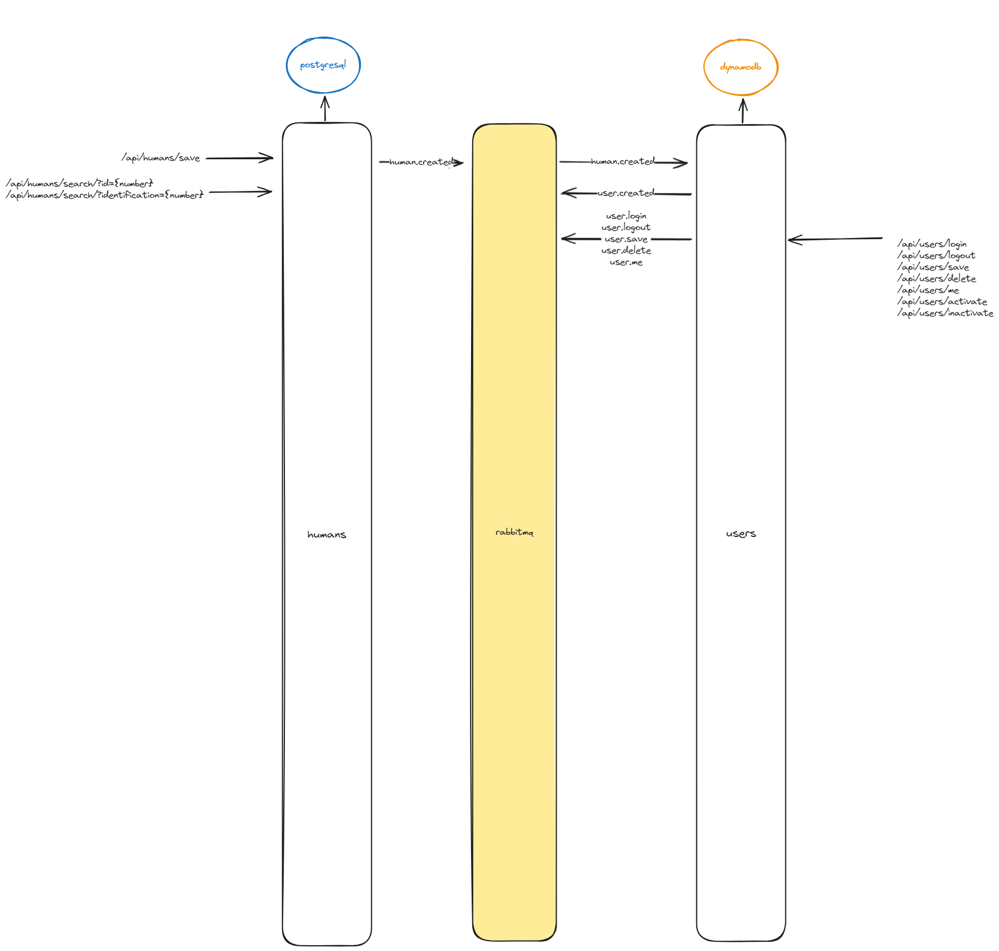

# Nuqui Tech wannabe bank 🏦 - Microservices with Spring Boot and Spring Reactor 🚀
## Overview
This repository contains a POC for set of microservices for a "_bank_" developed using Spring Boot and Spring Reactor, Spring Batch, providing a scalable and reactive architecture for modern applications.

# Getting Started 🏁
Follow these steps to set up and run the microservices locally:

Clone the Repository:

```bash
git clone https://github.com/cristianmarint/nuqui-tech.git
cd nuqui-tech/infrastructure
docker compose up -d
```
seed DynamoDB
```bash
aws dynamodb create-table `
    --table-name users `
    --attribute-definitions `
        AttributeName=id,AttributeType=S `
        AttributeName=humanId,AttributeType=N `
        AttributeName=email,AttributeType=S `
        AttributeName=username,AttributeType=S `
    --key-schema AttributeName=id,KeyType=HASH AttributeName=humanId,KeyType=RANGE `
    --provisioned-throughput ReadCapacityUnits=5,WriteCapacityUnits=5 `
    --global-secondary-indexes `
        'IndexName=emailindex,KeySchema=[{AttributeName=email,KeyType=HASH}],Projection={ProjectionType=ALL},ProvisionedThroughput={ReadCapacityUnits=5,WriteCapacityUnits=5}' `
        'IndexName=usernameindex,KeySchema=[{AttributeName=username,KeyType=HASH}],Projection={ProjectionType=ALL},ProvisionedThroughput={ReadCapacityUnits=5,WriteCapacityUnits=5}' `
    --endpoint-url http://localhost:8000 `
    --profile default

aws dynamodb put-item --table-name users --item '{\"deletedAt\": {\"S\": \"\"},\"email\": {\"S\": \"celestine96@hotmail.com\"}, \"humanId\": {\"N\": \"7\"}, \"id\": {\"S\": \"12ebc8ee-ff66-4455-ad3b-6a7c7413ac97\"}, \"password\": {\"S\": \"password7\"}, \"recentActivity\": {\"S\": \"LOGIN SUCCESSFUL AT 2024-01-01T20:34:25.627823900Z\"}, \"status\": {\"S\": \"ACTIVE\"}, \"token\": {\"S\": \"eyJhbGciOiJub25lIn0.eyJzdWIiOiJ1c2VybmFtZSIsImlhdCI6MTcwNDE0MTI2NSwiZXhwIjoxNzA0MTQxMjk1fQ.\"}, \"username\": {\"S\": \"username\"}}' --endpoint-url http://localhost:8000 --profile default
aws dynamodb put-item --table-name users --item '{\"deletedAt\": {\"S\": \"\"},\"email\": {\"S\": \"carlos@hotmail.com\"}, \"humanId\": {\"N\": \"8\"}, \"id\": {\"S\": \"12ebc8ee-ff66-4455-ad3b-6a7c7413ac98\"}, \"password\": {\"S\": \"password8\"}, \"recentActivity\": {\"S\": \"LOGIN SUCCESSFUL AT 2024-01-01T20:34:25.627823900Z\"}, \"status\": {\"S\": \"ACTIVE\"}, \"token\": {\"S\": \"eyJhbGciOiJub25lIn0.eyJzdWIiOiJ1c2VybmFtZSIsImlhdCI6MTcwNDE0MTI2NSwiZXhwIjoxNzA0MTQxMjk1fQ.\"}, \"username\": {\"S\": \"carlos\"}}' --endpoint-url http://localhost:8000 --profile default
aws dynamodb put-item --table-name users --item '{\"deletedAt\": {\"S\": \"\"},\"email\": {\"S\": \"contact@nuqui.tech\"}, \"humanId\": {\"N\": \"69\"}, \"id\": {\"S\": \"12ebc8ee-ff66-4455-ad3b-6a7c7413ac69\"}, \"password\": {\"S\": \"password69\"}, \"recentActivity\": {\"S\": \"LOGIN SUCCESSFUL AT 2024-01-01T20:34:25.627823900Z\"}, \"status\": {\"S\": \"ACTIVE\"}, \"token\": {\"S\": \"eyJhbGciOiJub25lIn0.eyJzdWIiOiJ1c2VybmFtZSIsImlhdCI6MTcwNDE0MTI2NSwiZXhwIjoxNzA0MTQxMjk1fQ.\"}, \"username\": {\"S\": \"nuquitechfee\"}}' --endpoint-url http://localhost:8000 --profile default
```

import from ```./infrastructure``` the postman collection

## Microservices Architecture 🏗️
The project is structured into individual microservices, each responsible for a specific business domain or functionality. Key features include:

- ms-humans:store information releated to humans 👌 in a PostgreSQL, publish events in RabbitMQ
- ms-users: store user accounts in DynamoDB, publish and listen events in RabbitMQ
- ms-deposits: store deposit accounts & deposit transactions in PostgreSQL,  publish and listen events in RabbitMQ and Kafka
- ms-emailer: sends email by listening events in RabbitMQ
- ms-logger: store user actions MongoDB, listen events in RabbitMQ and Kafka
- ms-batch-process: to do



## Technology Stack 🛠️
- Spring Boot: Harnesses the capabilities of the Spring ecosystem to build robust and scalable microservices.
- Spring Reactor: Implements reactive programming to adeptly handle asynchronous and non-blocking operations.
- Spring Batch: Enables batch processing for managing large-scale data processing tasks.
- RabbitMQ: Provides a reliable message broker for seamless communication between microservices.
- Kafka: Facilitates real-time event streaming and messaging for efficient data processing.
- DynamoDB: A NoSQL database for scalable and low-latency data storage.
- PostgreSQL: A powerful relational database for structured data storage and retrieval.
- MongoDB: A NoSQL document database for flexible and schema-less data storage.


# Contributing 🤝
Contributions are welcome! Please follow the Contribution Guidelines to contribute to the project.

## License 📄
This project is licensed under the MIT License.

## Contact 📧
For any inquiries or discussions, feel free to contact us at cristianmarint@gmail.com

Happy coding! 🚀🌟